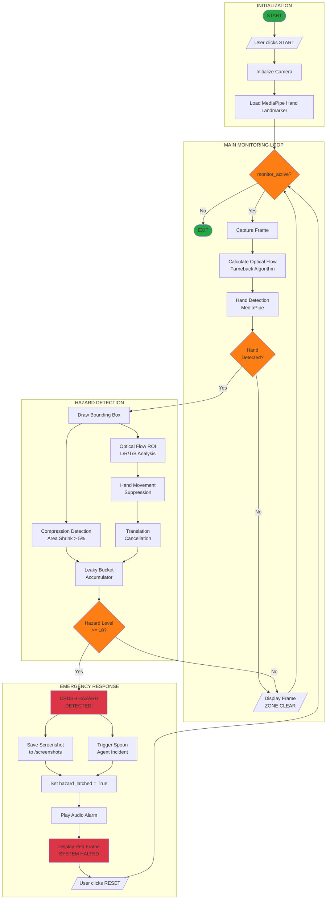

# Safety Lens: Active Sentinel - Flow Diagram

## Flow Description

### 1. Initialization
- User clicks **START SYSTEM** button
- Camera initialized via OpenCV (`cv2.VideoCapture`)
- MediaPipe Hand Landmarker model loaded

### 2. Main Monitoring Loop
While `monitor_active` is True:
1. Capture frame from camera
2. Calculate optical flow using Farneback algorithm
3. Detect hands using MediaPipe
4. If no hand detected, display "ZONE CLEAR" and continue

### 3. Hazard Detection (when hand detected)
1. **Draw Bounding Box** around detected hand
2. **Compression Detection** - monitors hand area shrinking (>5% = squeeze)
3. **Optical Flow ROI Analysis** - checks 4 regions around hand:
   - Left ROI: objects moving right toward hand
   - Right ROI: objects moving left toward hand
   - Top ROI: objects moving down toward hand
   - Bottom ROI: objects moving up toward hand
4. **Hand Movement Suppression** - ignores flow caused by hand itself moving (>15px/frame)
5. **Translation Cancellation** - filters out global camera/scene motion
6. **Leaky Bucket Accumulator** - accumulates hazard signals (+2 per detection, -1 decay)

### 4. Emergency Response (when hazard level >= 10)
1. Display **CRUSH HAZARD DETECTED!**
2. **Save screenshot** to `/screenshots/incident_YYYYMMDD_HHMMSS.jpg`
3. **Trigger Spoon Agent** incident logging
4. Set `hazard_latched = True`
5. **Play audio alarm**
6. Display red border with **SYSTEM HALTED**
7. Wait for user to click **RESET** to resume
